Please check we will also customise this
this has some reminder featurw
client can submit request also?
Yes sir we will update
As oer your requirements anc custemize all features
can you add automatic email notification to client
Or sms
When payment is due
Yes sir it required apis like sendgrid, aweber , twilio
You need to provide apis for that we will add and setup for you
i have twilio
Select Network
You can receive this asset on these networks.
Ethereum
ETH
0
BNB Smart Chain
0
BSC
Solana
SOL
0
Tron
TRX
0
Ok we will add
Which one
Trx
Tron trx okk
because i want to keep admin link private
sign up form sms, and email
And ID scan
Okk sir
we will add
name birthdate and address
Okk sir
after verification borrower can request a loan with the amount and intended payment date,
where client can choose from 1 month up to 12 months with description why is loan needed,
loan method cash with delivery fee 2% and 1% initiation fee client can pick contact method for
delivery address whatsapp,
for wire method 2% and 1% initiation client need to submit bank name account number
(CLABE) name of account
Ok sir i will add this
In both software which one you like so we will update this features and share
which is the third link?
only these two options?
Yes sir but we customize
Dont worry
As per your requirements
the second link
Yes
so how my loans work clients pay interest every month
so i want to have a calendar to remind me and my staff everyday whos interest has to be paid
Okk sir we will add
and also a day counter of how many days is late
with a custom no extra charge late term for everyclient lets say a client has to pay every day
10th and i want to give him 3 days no extra charge to pay so after the 13th he has to pay extra
and i want to set how much extra % and to get automatic calculation on back office and on
borrower site
This one
and also colateral option and client submits picture of colateral
Okk sir
also in my business i have people that bring me clients "external agents", for example they bring
one client, client pays 9% a month and once client pays the monthly my "agent" gets 1%
Ok commission and referal bonus we will add
Okk
what do you need on my ens
please create logo for me
—----------------------------------------------------------------------------------------------------------------------------
----------------------------------------------------------------------------------------------------------------------------
🔥 1. Overall System Samajh Lo (Simple)
Ye basically ek Loan Management System hai jisme:
● Admin (tumhara client)
● Staff
● Borrower (loan lene wala)
● External Agent (client laane wala)
👉 Sab log alag roles me kaam karenge.
👥 2. Roles & Access (Kaun kya karega)
🟢 1. Admin (Owner)
● Full control
● Sab manage karega
🟡 2. Staff
● Admin ke under kaam karega
● Loans manage karega, reminders dekhega
🔵 3. Borrower (Client)
● Loan apply karega
● Payment karega
● Documents upload karega
🟣 4. External Agent
● Client refer karega
● Commission earn karega
🔐 3. Authentication Flow
Signup (Borrower)
● Name
● Birthdate
● Address
● Phone (OTP via Twilio)
● Email (verification)
● ID Scan upload
👉 Admin verify karega → tabhi loan access milega
💰 4. Loan Flow (Step by Step)
Borrower kya karega:
1. Loan request karega:
○ Amount
○ Duration (1–12 months)
○ Reason (description)
2. Method choose karega:
🟢 Cash Method:
● Delivery address
● WhatsApp contact
● Charges:
○ 2% delivery fee
○ 1% initiation fee
🔵 Wire Method:
● Bank Name
● Account Number
● CLABE
● Account Name
💸 5. Interest System
● Monthly interest (example: 9%)
● Har month borrower payment karega
⏰ 6. Reminder + Calendar System
👉 IMPORTANT FEATURE
● Calendar view:
○ Daily list → kis client ka payment due hai
● SMS / Email reminder:
○ Twilio (SMS)
○ SendGrid/Aweber (Email)
⏳ 7. Late Payment Logic
Example:
● Due date: 10th
● Grace period: 3 days
👉 13th tak no penalty
👉 14th se penalty start
System automatically:
● Late days count karega
● Extra % calculate karega
● Admin + borrower dono ko show karega
📦 8. Collateral System
● Borrower image upload karega (e.g. gold, property, etc.)
● Admin verify karega
🤝 9. Agent System
● Agent client laata hai
● Example:
○ Client pays 9%
○ Agent gets 1%
👉 System:
● Commission track karega
● Monthly payout calculate karega
🪙 10. Payment Network (TRX)
Tumhare screenshot ke hisaab se:
👉 Client wants: TRON (TRX)
● Reason: privacy (admin link private rakhna)
● Crypto wallet integration hoga
📊 11. Dashboard Wireframe (IMPORTANT
🔥)
🟢 ADMIN DASHBOARD
Menu:
1. Dashboard
○ Total Loans
○ Active Clients
○ Pending Payments
○ Late Payments
2. Users
○ Borrowers
○ Staff
○ Agents
3. Loan Management
○ All Loans
○ Pending Requests
○ Approved Loans
4. Payments
○ Payment History
○ Due Payments
5. Calendar
○ Daily Due List
6. Commission
○ Agent Earnings
7. Settings
○ Interest %
○ Late Fee %
○ Grace Days
🟡 STAFF DASHBOARD
Menu:
● Dashboard
● Loan Requests
● Payments
● Calendar
🔵 BORROWER DASHBOARD
Menu:
1. Dashboard
○ Active Loan
○ Due Date
○ Amount
2. Apply Loan
3. My Loans
4. Payments
5. Upload Collateral
🟣 AGENT DASHBOARD
Menu:
● My Clients
● Commission Earnings
● Payment History
🔄 12. Flow (Simple Diagram Style)
Borrower Signup → Verification → Loan Request → Admin Approves
→ Loan Active → Monthly Payment → Reminder → Late Calculation
→ Agent Commission (if any)
👉 "We need a complete Loan Management System with 4 roles (Admin, Staff, Borrower,
Agent), including loan request flow, payment tracking, TRX crypto integration, calendar
reminders, late fee automation, collateral upload, and commission system."

<<<<<<<<<<<<<<<<<<<<<<<<<<<<<<<<<<<<<<<<<<<<<<<<<<<<<<<<<<<<<<<<<<<<<<<<<<<<<<<
>>>>>>>>>>>>>>>>>>>>>>>>>>>>>>>>>>>>>>>>>>>>>>>>>>>>>>>>>>>>>>>>>>>>>>>>>>>>>>>

[12:11, 13/04/2026] Kiaan Nalini Paras: yes but honestly
[12:11, 13/04/2026] Kiaan Nalini Paras: i  dont like it
[12:11, 13/04/2026] Kiaan Nalini Paras: its too confusing
[12:11, 13/04/2026] Kiaan Nalini Paras: Ok sir share yout logics we will add no issues
[12:11, 13/04/2026] Kiaan Nalini Paras: Like you can just text your idea
[12:11, 13/04/2026] Kiaan Nalini Paras: We will implement
[12:11, 13/04/2026] Kiaan Nalini Paras: i want everything very simple
[12:11, 13/04/2026] Kiaan Nalini Paras: for borrower
[12:11, 13/04/2026] Kiaan Nalini Paras: and.for admin
[12:11, 13/04/2026] Kiaan Nalini Paras: pls review my request
[12:11, 13/04/2026] Kiaan Nalini Paras: not too much options
[12:11, 13/04/2026] Kiaan Nalini Paras: basically just request and keep track of loan
[12:11, 13/04/2026] Kiaan Nalini Paras: the system doesnt look clean
[12:11, 13/04/2026] Kiaan Nalini Paras: if u need to make it white again

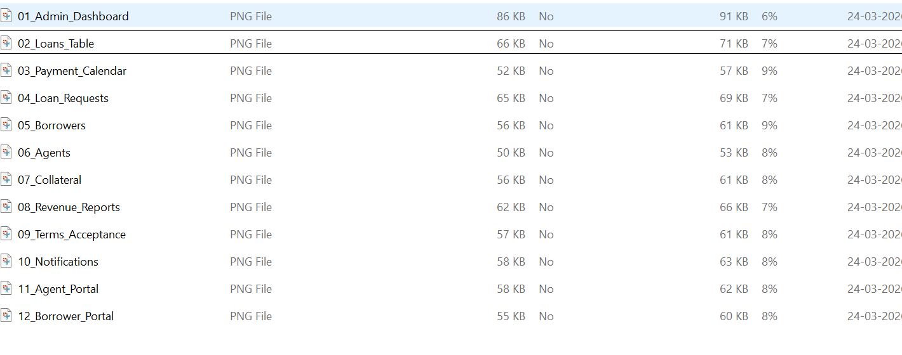

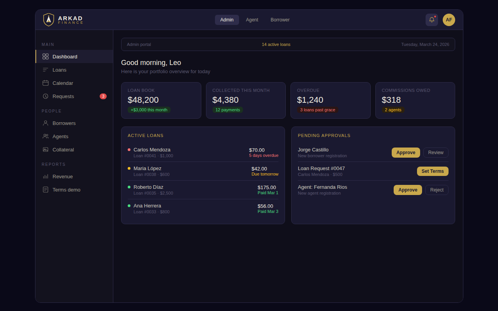

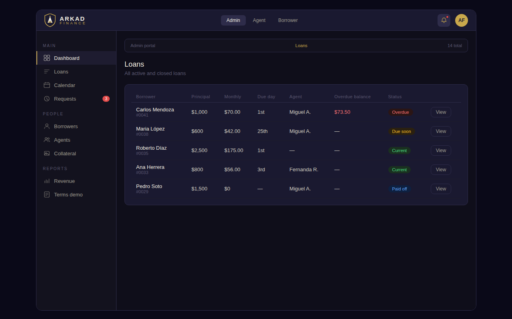

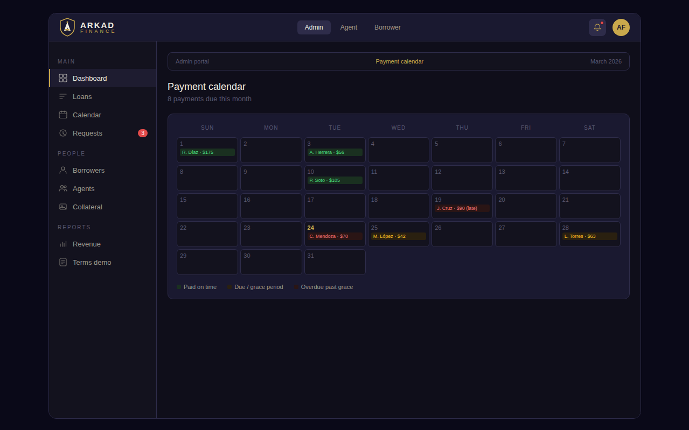
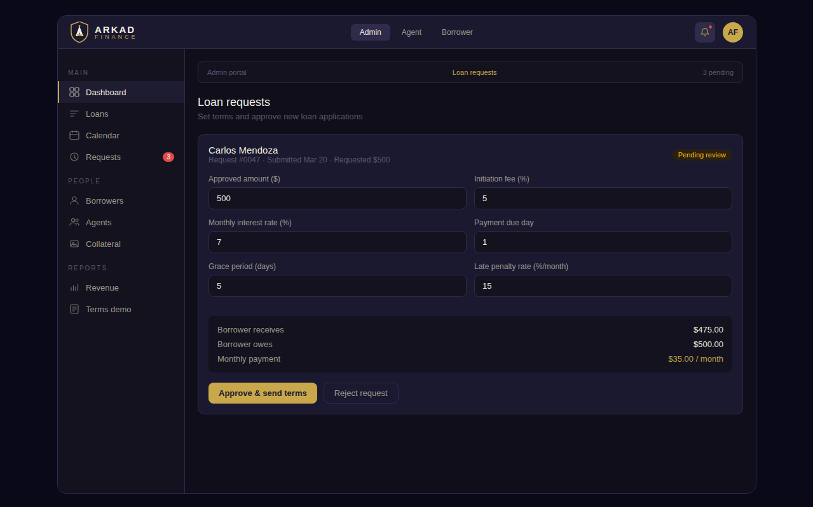

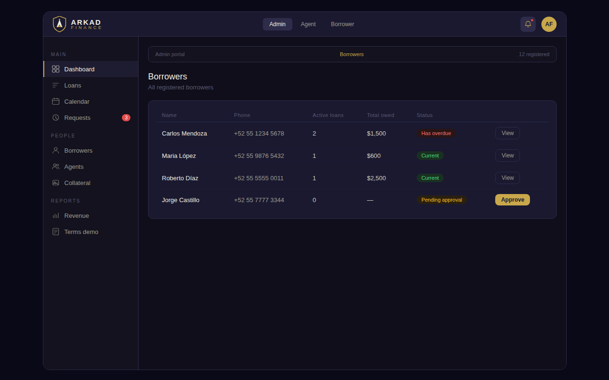

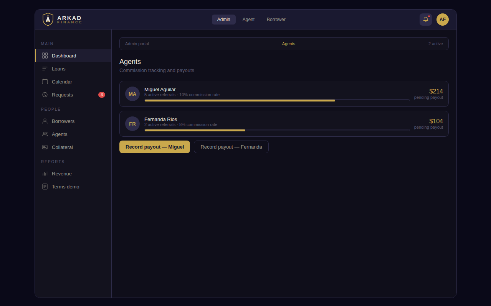
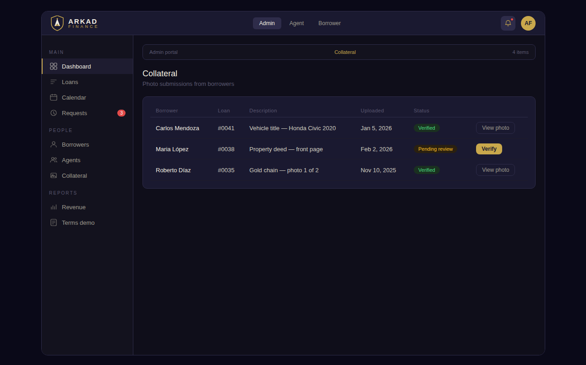

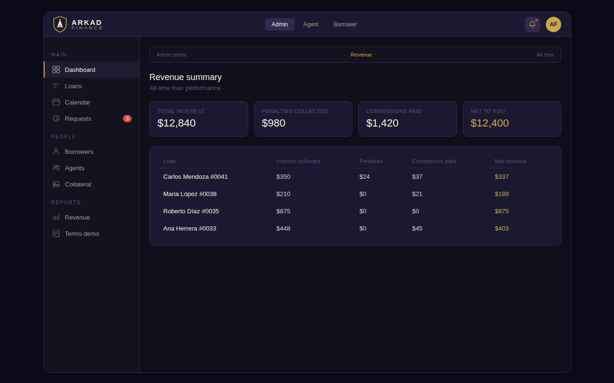

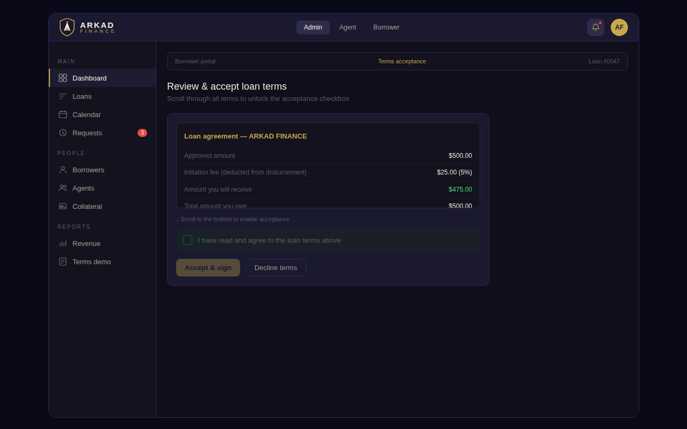

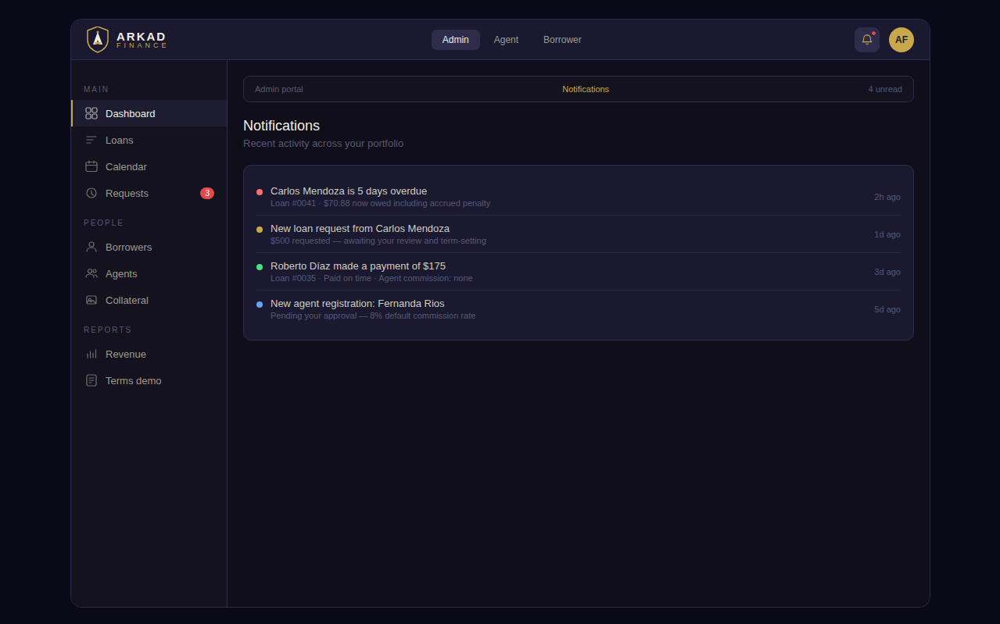

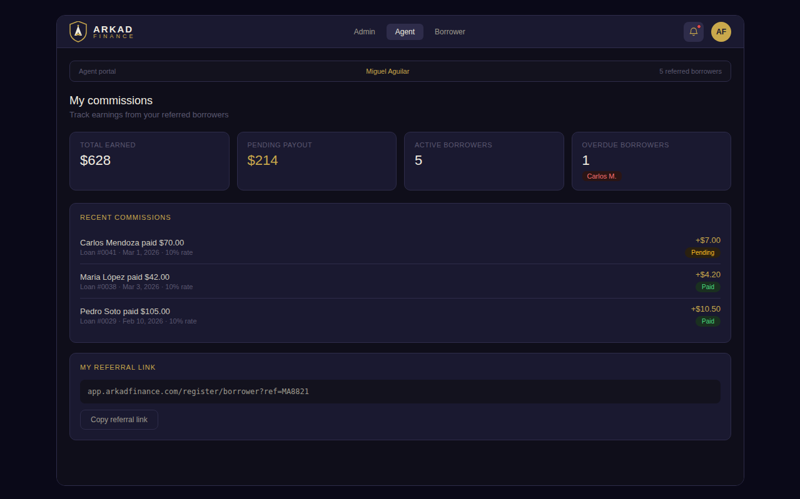

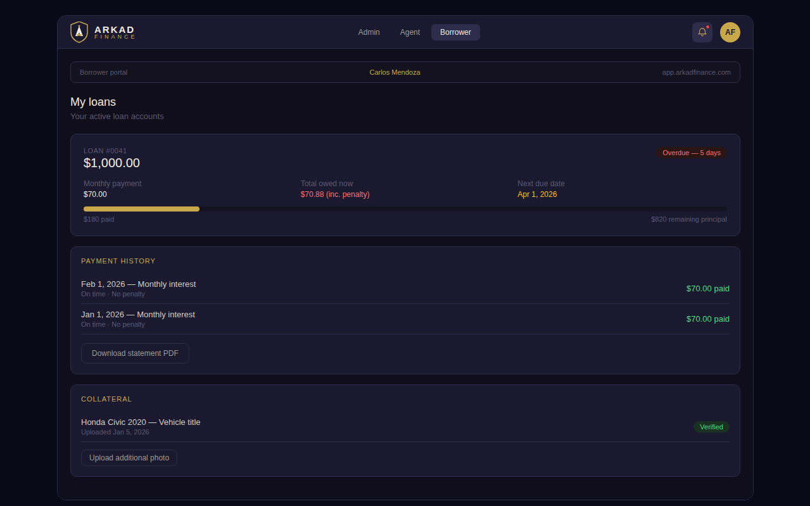

Borrower,Principal (K),Interest Rate,Duration,Status,Agent,Due Day

Yes this will we update
example client loan $100 monthly 10%=$10 
late payment 13 days
late fee 15% monthly
unpaid balance 10×15%=1.5/30(days)*13(days)=.65
to pay $10.65
Ok.
Sir the amount percentage updates have been done in the UI Please check
Hello Sir, just a quick update  the backend is currently in progress and most of the work has been completed. You will receive the software link by Monday evening. Thank you
ok sir
thank u sie
sir
Yes sir
We try to finish complete on Monday
Hello Sir, just a quick update — the software is almost ready and has been completed from our end. It’s currently in the final testing phase to ensure everything runs smoothly without any issues.
We are making sure you get a flawless experience, and we’ll be sharing the live link with you by tomorrow morning. Thank you for your patience
can we do.this
on.a.zoom
i want you.to guide me.through the whole.process
also can you add this to my url
two url one for admin/lender another one for borrower.and agent
so i created this loan.request
but i want to be able
to manage de interest rate
instead of 10 maybe 9
because.it.depends on amount
Ok sir
also some times clients pay the monthly interest
so i need to be able to have a option for principal amount paid
and that will change the
next months interest
also once payment received i want to know to keep track of how much each loan has generated
and i want agents and borrowers to be able to sign up
please make this fully functional
please check my requirenments
this.one looks very confusing
it.shows.stuff.i.dont.need
pls.delete.dummy data
so.we.can.do.proper
test
does the referal link work?
borrower sends request 100k 6 months description vacation
lender gets notification
borrower A request 100k etc.
lender clicks choose agent or none
lender sets interest rate monthly
lender sets late interest
lender sets grace days
lender sets initiation percentage
7% monthly 10% late payment agent A, initiation fee 3% grace days 3
borrower gets offer
with mentioned details and shows he will get 97k after deducting the initiation fee
borrower has to submit picture of ID and picture of proof of address
to complete his profile
this.is.on.the borrower.site
borrower cant.choose
initiarion.fee or.delivery fee
that is up.to.the admin
can u explain the math
fornthe late fee
lets say he missed 14.days
and.late fee.rate.is.5%
interest rate 10%
amount 100k
also pls.remove when client requests lone it shows K currency
also
it.doesnt show.the dates
its very important to have date that the loan.was
created
initiated
yes but honestly
i  dont like it
its too confusing
.
i want everything very simple
for borrower
and.for admin
pls review my request
not too much options
basically just request and keep track of loan
the system doesnt look clean
if u need to make it white again
pls do

Also there are many solution
whats besy
Twilio is best
ok
so i want admin to be able to set agent % on each loan cause all are different
Yes this will we update
example client loan $100 monthly 10%=$10 
late payment 13 days
late fee 15% monthly
unpaid balance 10×15%=1.5/30(days)*13(days)=.65
to pay $10.65
Ok.
Sir the amount percentage updates have been done in the UI Please check
Hello Sir, just a quick update  the backend is currently in progress and most of the work has been completed. You will receive the software link by Monday evening. Thank you
ok sir
thank u sie
sir
Yes sir
We try to finish complete on Monday
Hello Sir, just a quick update — the software is almost ready and has been completed from our end. It’s currently in the final testing phase to ensure everything runs smoothly without any issues.
We are making sure you get a flawless experience, and we’ll be sharing the live link with you by tomorrow morning. Thank you for your patience
can we do.this
on.a.zoom
i want you.to guide me.through the whole.process
also can you add this to my url
two url one for admin/lender another one for borrower.and agent
so i created this loan.request
but i want to be able
to manage de interest rate
instead of 10 maybe 9
because.it.depends on amount
Ok sir
also some times clients pay the monthly interest
so i need to be able to have a option for principal amount paid
and that will change the
next months interest
also once payment received i want to know to keep track of how much each loan has generated
and i want agents and borrowers to be able to sign up
please make this fully functional
please check my requirenments
this.one looks very confusing
it.shows.stuff.i.dont.need
pls.delete.dummy data
so.we.can.do.proper
test
does the referal link work?
borrower sends request 100k 6 months description vacation
lender gets notification
borrower A request 100k etc.
lender clicks choose agent or none
lender sets interest rate monthly
lender sets late interest
lender sets grace days
lender sets initiation percentage
7% monthly 10% late payment agent A, initiation fee 3% grace days 3
borrower gets offer
with mentioned details and shows he will get 97k after deducting the initiation fee
borrower has to submit picture of ID and picture of proof of address
to complete his profile
this.is.on.the borrower.site
borrower cant.choose
initiarion.fee or.delivery fee
that is up.to.the admin
can u explain the math
fornthe late fee
lets say he missed 14.days
and.late fee.rate.is.5%
interest rate 10%
amount 100k
also pls.remove when client requests lone it shows K currency
also
it.doesnt show.the dates
its very important to have date that the loan.was
created
initiated
yes but honestly
i  dont like it
its too confusing
.
i want everything very simple
for borrower
and.for admin
pls review my request
not too much options
basically just request and keep track of loan
the system doesnt look clean
if u need to make it white again
pls do